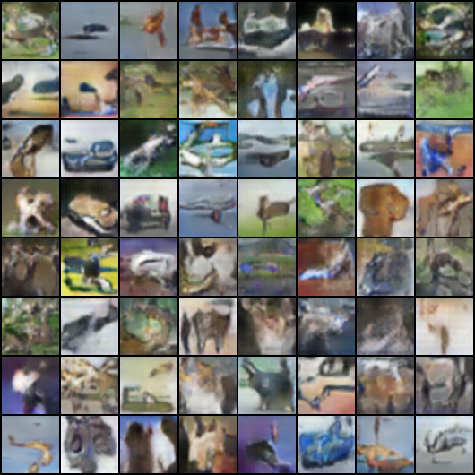

## Generate images using GANs

*Dataset used:* **CIFAR10**

*Framework:* **PyTorch**

*Number of epochs:* **10**

**Requirements:**

 - Python >= 3.5.
 
 - NumPy

 - Matplot

 - PyTorch

### Some results

**PS:** Only used 10 epochs due to GPU limitations

*References:*  
 - Computer Vision From A to Z course on Udemy
